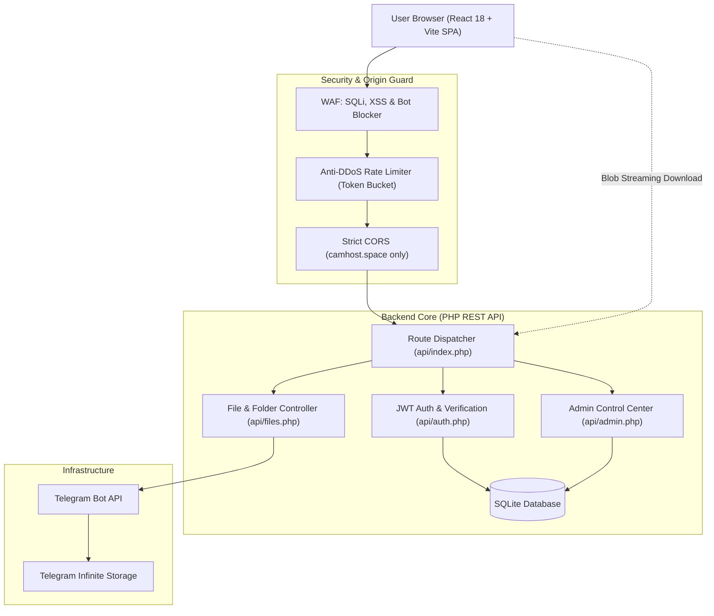

# CamHost.space — Open Source Cloud Storage

<div align="center">


**High-Performance Private Cloud Storage Platform Powered by Telegram Infrastructure**

*Secure browser-based uploads · Telegram cloud backend · Dedicated System Admin control center · Zero hosting storage limits*

</div>

---

## Overview

**CamHost.space** is a modern, open-source cloud storage and file-sharing ecosystem. It bridges a sleek React Single Page Application (SPA) with a lightweight, enterprise-secured PHP REST API that streams uploaded assets directly into Telegram's cloud storage network.

Files up to 2GB each are hosted across private Telegram channels with zero disk consumption on the application host.

---

## Architecture



---

## Key Features

### 1. Modern React Frontend (SPA)
- **Vite-Powered React 18**: Instant page transitions with React Router.
- **Glassmorphic Aesthetics**: Modern dark and light themes with fluid animations.
- **Interactive File Explorer**: Drag-and-drop uploads, nested folder support, file rename, move, and share links.
- **Branded In-Memory Downloads**: Downloads stream through client-side Blob instances (`camhost.space` origin attribution).
- **Vercel & Hostinger Ready**: Full rewrite support via `vercel.json` and `.htaccess`.

### 2. Enterprise Security & Anti-DDoS
- **Active Web Application Firewall (WAF)**: Filters malicious query strings, SQL injections, script payloads, path traversal (`../`), and automated vulnerability scanners (`nikto`, `sqlmap`, `acunetix`, etc.).
- **Dynamic Rate Limiter (Token Bucket)**:
  - General endpoints: Max 120 requests/minute per IP.
  - Login endpoint: Max 5 attempts per 15 minutes to eliminate credential stuffing.
  - Registration: Max 5 new accounts per hour per IP.
- **Strict Origin Enforcement**: API rejects cross-origin requests outside of `https://camhost.space`.
- **Constant-Time Cryptography**: Employs `hash_equals()` across all tokens to prevent timing attacks.
- **Dangerous File Quarantine**: Automatic rejection of executable extensions (`.php`, `.exe`, `.sh`, `.phar`, `.phtml`).

### 3. Account Lifecycle & Activation
- **Link Verification**: Accounts require verification via 64-character activation links (`/verify-account?token=...`).
- **Account Suspension**: Immediate login restriction for banned accounts.
- **Session Tokens**: Cryptographically signed JWT tokens (HMAC-SHA256).

### 4. System Admin Control Center (`/admin`)
- **Real-Time Overview**: Live counters for users, files, storage consumed (bytes), downloads, and rate-limit hits.
- **User Management**: Search users, toggle bans/suspensions, adjust storage quotas (MB), switch roles (`admin`/`user`), and trigger password resets.
- **File & Storage Governance**: Global file registry, DMCA/abuse blocking, file deletion from Telegram, and Telegram File ID inspection.
- **Platform Core Settings**: Maintenance Mode switch (with custom 503 banner), maximum upload size (MB), allowed extensions, and guest download permissions.
- **Security Audit Logs**: Immutable log of all administrative actions with administrator email, action code, target ID, client IP, and timestamp.
- **System Health & APIs**: Real-time SQLite query latency probe, Telegram Bot API `getMe` connection test with ping latency, host memory usage, and one-click cache purge.

---

## Technology Stack

| Component | Technology | Description |
| :--- | :--- | :--- |
| **Frontend Framework** | React 18 + Vite | Single Page Application with React Router |
| **Styling** | Vanilla Modern CSS | Design tokens, glassmorphism, responsive grid |
| **Deployment (Web)** | Vercel / Hostinger | Global edge CDN routing with `vercel.json` |
| **Backend Runtime** | PHP 8.1+ | Zero-dependency REST API |
| **Database** | SQLite 3 (PDO) | Lightweight, zero-maintenance local database |
| **Storage Backend** | Telegram Bot API | Infinite private file hosting up to 2GB/file |
| **Authentication** | JWT (HMAC-SHA256) | Stateless bearer token authentication |

---

## Getting Started

### Prerequisites
- Node.js 18+ & npm
- PHP 8.1+ with `pdo_sqlite`, `curl`, and `openssl` extensions
- A Telegram Bot Token from [@BotFather](https://t.me/BotFather)
- A private Telegram Channel or Group ID

---

### Local Development Setup

1. **Clone the repository:**
   ```bash
   git clone https://github.com/peak-brosmao/CamHost.space-Open-Soucre.git
   cd CamHost.space-Open-Soucre
   ```

2. **Install frontend dependencies:**
   ```bash
   npm install
   ```

3. **Configure backend environment:**
   Copy the template to `api/.env`:
   ```bash
   cp api/.env.example api/.env
   ```
   Edit `api/.env` with your Telegram Bot credentials:
   ```env
   TELEGRAM_BOT_TOKEN="your_bot_token_here"
   TELEGRAM_CHAT_ID="your_channel_or_chat_id_here"
   JWT_SECRET="your_cryptographically_secure_random_key"
   ADMIN_EMAIL="admin@camhost.space"
   ADMIN_PASSWORD="YourSecurePasswordHere"
   ```

4. **Start the local PHP server:**
   ```bash
   php -S 127.0.0.1:8000 -t api
   ```

5. **Start the Vite dev server:**
   ```bash
   npm run dev
   ```

6. Open `http://localhost:5173` in your browser.

---

### Running Automated Tests

CamHost.space includes a test suite verifying database migrations, WAF rules, rate limiting, and JWT lifecycles:

```bash
php test_suite.php
```

---

## Production Deployment

### Frontend (Vercel)
1. Import the repository in **Vercel**.
2. Set Framework Preset to **Vite**.
3. (Optional) Set Environment Variable `VITE_API_URL` to `https://api.camhost.space`.
4. Click **Deploy**. Vercel will automatically read [`vercel.json`](vercel.json) to handle SPA client-side routing.

### Backend (`api.camhost.space`)
1. Upload the contents of `api/` (or extract [`api.zip`](api.zip)) to your backend web root (e.g. `public_html` on your subdomain).
2. Create `.env` using `.env.example` as a template.
3. Ensure the web server has write permissions to create the SQLite database in `api/` or `data/`.

---

## Project Structure

```
├── api/                     # PHP REST API Backend
│   ├── .env.example         # Environment template (untracked .env)
│   ├── .htaccess            # Apache/LiteSpeed routing & access denial
│   ├── admin.php            # Enterprise Admin Control Center controller
│   ├── auth.php             # Authentication, verification & JWT logic
│   ├── config.php           # Config loader & environment parser
│   ├── db.php               # SQLite connection & schema migrations
│   ├── files.php            # File management, sharing & Telegram streaming
│   ├── folders.php          # Folder hierarchy controller
│   ├── index.php            # Central API router & maintenance mode
│   ├── security.php         # WAF, rate limiter & token comparison
│   ├── signup.php           # Landing page waitlist handler
│   └── upload.php           # Chunked upload handler & extension validator
├── src/                     # React 18 Frontend
│   ├── api/client.js        # Central API client & Blob download helpers
│   ├── components/          # Shared components (Header, Sidebar, Topbar, Toast)
│   ├── context/             # AuthContext & ThemeContext
│   ├── pages/               # LandingPage, LoginPage, RegisterPage, FilesPage,
│   │                        # FoldersPage, UploadPage, SettingsPage, SharePage,
│   │                        # VerifyAccountPage, AdminPage
│   ├── App.jsx              # Application router & protected route guards
│   └── main.jsx             # React DOM entry point
├── vercel.json              # Vercel SPA routing rewrites
├── vite.config.js           # Vite configuration & build pipeline
└── package.json             # Frontend dependencies & scripts
```

---

## Contributing

Contributions, bug reports, and feature suggestions are welcome!

1. Fork the repository
2. Create your feature branch (`git checkout -b feature/amazing-feature`)
3. Commit your changes (`git commit -m "feat: add amazing feature"`)
4. Push to the branch (`git push origin feature/amazing-feature`)
5. Open a Pull Request

---

## License

This project is open source and available under the [MIT License](LICENSE).

---

<div align="center">
  Developed with care by <a href="https://github.com/peak-brosmao">peak-brosmao</a> · <a href="https://peakbrosmao.me">peakbrosmao.me</a>
</div>
