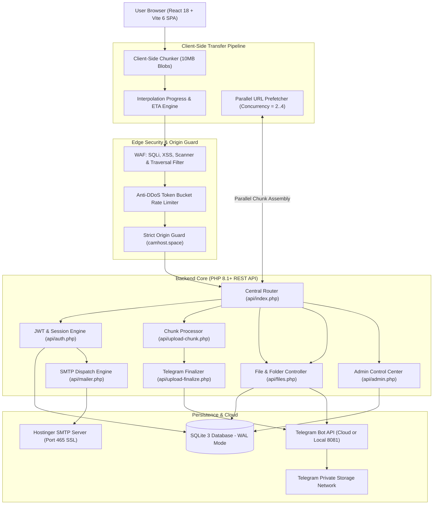

# CamHost.space — Open Source Cloud Storage

<div align="center">

  

  # ☁️ CamHost.space
  
  **High-Performance Private Cloud Storage Platform Powered by Telegram Infrastructure**

  <p align="center">
    <a href="https://camhost.space" target="_blank">
      
    </a>
    <a href="https://api.camhost.space" target="_blank">
      
    </a>
    <a href="https://github.com/peak-brosmao/CamHost.space-Open-Soucre" target="_blank">
      
    </a>
    
  </p>

  <p align="center">
    
    
    
    
    
    
    
    
  </p>

  <p align="center">
    <em>Zero hosting disk consumption · Client-side 10MB chunking engine · Parallel download prefetching · Dedicated Linear-inspired Admin Control Center · Desktop-grade file explorer</em>
  </p>

</div>

---

## 📖 Table of Contents

- [Overview](#-overview)
- [System Architecture](#-system-architecture)
- [Key Features](#-key-features)
  - [1. 2GB Multi-Part Chunking & Transfer Engine](#1-2gb-multi-part-chunking--transfer-engine)
  - [2. Enterprise Admin Control Center (`/admin`)](#2-enterprise-admin-control-center-admin)
  - [3. Desktop-Grade File Explorer & Storage Hub](#3-desktop-grade-file-explorer--storage-hub)
  - [4. Branded Share Experience & Public Pages](#4-branded-share-experience--public-pages)
  - [5. Enterprise Security, WAF & Anti-DDoS](#5-enterprise-security-waf--anti-ddos)
  - [6. Account Lifecycle & Hostinger SMTP Dispatch](#6-account-lifecycle--hostinger-smtp-dispatch)
- [Technology Stack](#-technology-stack)
- [Project Directory Structure](#-project-directory-structure)
- [Environment Configuration (`api/.env`)](#-environment-configuration-apienv)
- [Local Development Setup](#-local-development-setup)
- [Production Deployment](#-production-deployment)
  - [Frontend Deployment (Vercel)](#frontend-deployment-vercel)
  - [Backend Deployment (Hostinger / cPanel / VPS)](#backend-deployment-hostinger--cpanel--vps)
- [Administrative Utilities](#-administrative-utilities)
- [Contributing](#-contributing)
- [License & Author](#-license--author)

---

## 🌟 Overview

**CamHost.space** is a full-featured, open-source personal cloud storage ecosystem engineered to eliminate server storage costs. Instead of renting expensive block storage or object buckets, CamHost.space transparently streams uploaded assets into Telegram's global cloud infrastructure.

Files up to **2GB each** are sliced into 10MB chunks directly in the user's browser, dispatched with concurrent worker streams, and stored securely across private Telegram channels. When downloading, CamHost's parallel prefetch engine reconstructs the binary stream with zero chunk buffering pauses, delivering a seamless Google Drive-like experience.

### Why CamHost.space?
- **Infinite Cloud Capacity**: Leverages Telegram's free, distributed storage network with 0MB host disk storage needed.
- **Enterprise-Grade Security**: Integrated Web Application Firewall (WAF), Token Bucket rate limiter, and constant-time cryptographic token verification.
- **Complete Operational Control**: A dedicated 11-section Admin Control Center with 18 live setting panels, telemetry, health probes, and audit logs.
- **Zero Heavy Framework Bloat**: Clean React 18 frontend paired with a high-efficiency vanilla PHP 8.1+ REST API and SQLite 3 in WAL mode.

---

## 🏗️ System Architecture



---

## ✨ Key Features

### 1. 2GB Multi-Part Chunking & Transfer Engine
- **Client-Side Chunking**: Files are partitioned into 10MB chunks in the browser using the HTML5 File/Blob API. Uploads scale smoothly up to **2,000 MB (2 GB)** per file.
- **Parallel Worker Concurrency**: Staggered chunk dispatch (`concurrency=2` to `4`) maximizes network throughput without choking browser thread execution.
- **Smooth Interpolation Progress**: Custom timer interpolates progress smoothly between 0% and 100%, eliminating artificial freezing at 10MB chunk boundaries.
- **Speed (MB/s) & Dynamic ETA**: Live throughput calculator displays instantaneous upload transfer speed and remaining estimated time.
- **Duplicate File Detection**: Scans destination directory prior to upload and triggers an interactive **Replace or Skip** modal.
- **Parallel URL Prefetching for Downloads**: Eliminates 10MB chunk pauses during multi-part file downloads by prefetching subsequent chunks in parallel before memory assembly.
- **Local Bot vs Cloud Auto-Detection**: Seamlessly falls back from a local Telegram Bot API server (`http://127.0.0.1:8081`) to multi-part cloud chunking without manual configuration changes.
- **Preserved File Fidelity**: Downloads retain original filenames, extensions, and MIME types with client-side Blob stream generation.

---

### 2. Enterprise Admin Control Center (`/admin`)
A dedicated, high-aesthetic administration suite built with a deep slate/indigo Linear-inspired design system:

| Section | Route | Capabilities |
| :--- | :--- | :--- |
| **Telemetry Dashboard** | `/admin/dashboard` | Live statistics: Total users, active files, storage consumed (bytes), download counters, and rate-limit hits. |
| **User Management** | `/admin/users` | Real-time user search, quota adjustment (MB), role promotion (`admin`/`user`), ban/suspension toggle, password reset trigger, and safe user deletion. |
| **User Activity Stream** | `/admin/users/activity` | Chronological feed of user registrations, logins, uploads, and security events. |
| **Global File Registry** | `/admin/files` | Complete storage browser across all accounts, DMCA/abuse takedowns, Telegram `file_id` inspector, and file purging. |
| **Reported & Blocked** | `/admin/files/reported` | Direct moderation queue for user-flagged files with one-click quarantine. |
| **Storage & Uploads** | `/admin/storage`, `/admin/uploads` | Detailed analytics breakdown on file type distribution, bandwidth consumption, and peak upload periods. |
| **Security & Audit Logs** | `/admin/security` | Immutable security audit log tracking admin actions with email, IP address, target ID, and timestamp. WAF sensitivity toggles. |
| **System Health Probes** | `/admin/health` | Real-time SQLite query latency measurement, Telegram Bot API `getMe` round-trip ping test, host memory usage, and one-click cache purge. |
| **18 Operational Settings** | `/admin/settings/:section` | Dynamic switches for Maintenance Mode (custom 503 banner), Max Upload Size, Allowed/Blocked Extensions, Guest Downloads, SMTP testing, and Session Lifetime. |

---

### 3. Desktop-Grade File Explorer & Storage Hub
- **Right-Click Desktop Context Menus**: Native OS-like right-click menus on both file cards and empty background areas (Rename, Move, Share, Download, Details, Delete).
- **Nested Folder Hierarchy**: Create directories, navigate breadcrumbs, and move files across folder trees.
- **Dual View Modes**: Instant switching between **List View** (default) and **Grid View** with persistent `localStorage` preference.
- **Preconfigured Storage Views**:
  - 📁 **All Files** (`/files`) & **Folders** (`/folders`)
  - 🔗 **Shared Items** (`/shared` / `/shared-items`)
  - ⏱️ **Recents** (`/recents`) & ⭐ **Favourites** (`/favourites`)
  - 🗑️ **Rubbish Bin** (`/rubbish-bin` / `/trash`)
  - 💻 **Device Centre** (`/device-centre`): Multi-device sync hub with PWA & WebDAV connectivity roadmaps.
  - 🗄️ **Object Storage** (`/object-storage`): S3-compatible API access keys and bucket roadmap.
- **Real-Time Storage Quota Bar**: Compact sidebar widget dynamically computing consumed MB vs maximum allotted user quota.

---

### 4. Branded Share Experience & Public Pages
- **Interactive Share Portal (`/share/:token`)**:
  - Gradient header, responsive card layout, and direct file preview (images, audio, video, PDF, text).
  - Expiration badge, download limit counter, and file metadata grid.
  - Built-in **Report Abuse / DMCA** modal for public compliance.
- **Public & Informational Pages**:
  - **Landing Page (`/`)**: High-converting hero showcase with dynamic storage statistics and interactive mockups.
  - **Features (`/features`)**: Deep-dive feature showcase of the platform architecture.
  - **How It Works (`/how-it-works`)**: Visual step-by-step explainer of Telegram cloud chunking.
  - **Explorer / Preview (`/preview`, `/explorer`)**: Interactive sandbox preview for visitors.
  - **Open Source Manifesto (`/opensource`)**: Open development philosophy, roadmap, and MIT licensing.
  - **Blog System (`/blog`, `/blog/:slug`)**: Built-in engineering updates and feature announcements.

---

### 5. Enterprise Security, WAF & Anti-DDoS
- **Active Web Application Firewall (WAF)**:
  - Detects and drops SQL injection attempts (`UNION SELECT`, `SLEEP()`, `' OR '1'='1`).
  - Blocks Cross-Site Scripting (XSS) script injections and malicious payloads.
  - Blocks path traversal attacks (`../`, `..\`, `%2e%2e`).
  - Drops automated vulnerability scanners by user-agent signature (`nikto`, `sqlmap`, `acunetix`, `havij`, `wpscan`).
- **Dynamic Token Bucket Rate Limiting**:
  - General API endpoints: Max 120 requests/minute per IP.
  - Chunk upload endpoints: Max 200 requests/minute per IP (optimized for parallel chunk streams).
  - Login endpoint: Max 5 attempts per 15 minutes (automatically cleared upon successful authentication).
  - Registration endpoint: Max 5 new accounts per hour per IP.
- **Strict Origin Enforcement**: Cross-origin requests outside of configured `ALLOWED_ORIGINS` are rejected immediately.
- **Timing-Safe Cryptography**: Employs PHP `hash_equals()` across all tokens and hash validations to defeat timing attacks.
- **Dangerous Executable Quarantine**: Rejects malicious server-side scripts (`.php`, `.phtml`, `.phar`, `.sh`) while allowing legitimate user executables (`.exe`, `.apk`, `.zip`).

---

### 6. Account Lifecycle & Hostinger SMTP Dispatch
- **Hostinger SMTP Email Dispatch**:
  - Sender configured as `noreply@camhost.space` with replies directed to `support@camhost.space`.
  - Sends multipart/alternative HTML emails with embedded CSS and strict anti-spam headers (`X-Mailer`, `Auto-Submitted`, `List-Unsubscribe`).
- **Dual Activation Channels**:
  - Instant activation link (`/verify-account?token=...`).
  - 6-digit numeric activation code input fallback on the verification screen.
- **Session Tokens**: Cryptographically signed HMAC-SHA256 JWT tokens with automatic session refresh.

---

## 🛠️ Technology Stack

| Layer | Technology | Purpose & Details |
| :--- | :--- | :--- |
| **Frontend Core** | React 18.3 + Vite 6 | Fast SPA rendering, component modularity, instant HMR |
| **Client Routing** | React Router v6 | Client-side routing with protected route guards (`/admin`, `/files`) |
| **Styling & Theme** | Vanilla Modern CSS | Design tokens, glassmorphism, responsive grid, Dark/Light modes |
| **Backend Runtime** | PHP 8.1+ | Zero-dependency, lightweight REST API architecture |
| **Database** | SQLite 3 (PDO) | Zero-maintenance SQL database running in WAL mode with 60s busy timeout |
| **Storage Engine** | Telegram Bot API | Infinite private file hosting across private Telegram channels (up to 2GB/file) |
| **Authentication** | JWT (HMAC-SHA256) | Stateless bearer token authentication with constant-time verification |
| **Security Layer** | Custom WAF + Token Bucket | In-memory token bucket rate limiter, SQLi/XSS/scanner blocking |
| **Mail Transport** | Hostinger SMTP (Port 465 SSL) | System transactional emails (`noreply@camhost.space`) |
| **Production Hosting** | Vercel (SPA) / Hostinger (API) | Global edge CDN frontend with Apache/LiteSpeed PHP backend |

---

## 📁 Project Directory Structure

```
CamHost.space-Open-Soucre/
├── api/                            # PHP REST API Backend Core
│   ├── .env.example                # Configuration template (rename to .env)
│   ├── .htaccess                   # Apache/LiteSpeed routing rewrites & security blocks
│   ├── .user.ini                   # PHP runtime overrides (upload_max_filesize=2000M)
│   ├── admin.php                   # Enterprise Admin Control Center controller
│   ├── auth.php                    # Authentication, session tokens & registration
│   ├── config.php                  # Environment parser & system configuration
│   ├── cron.php                    # Background cron tasks (cleanup expired files/tokens)
│   ├── db.php                      # SQLite connection, WAL mode & schema migrations
│   ├── files.php                   # File metadata, search, download & sharing controller
│   ├── folders.php                 # Folder hierarchy & file relocation controller
│   ├── index.php                   # Central API router, CORS & Maintenance Mode guard
│   ├── mailer.php                  # Hostinger SMTP email dispatch & HTML templates
│   ├── reset_admin.php             # Admin password reset utility (CLI & browser fallback)
│   ├── security.php                # WAF, token bucket rate limiter & security sanitation
│   ├── signup.php                  # Marketing landing page waitlist handler
│   ├── upload.php                  # Monolithic file upload handler
│   ├── upload-chunk.php            # Multi-part 10MB chunk receiver
│   └── upload-finalize.php         # Chunk assembly & Telegram Cloud streaming engine
├── public/                         # Static Assets Served at Web Root
│   ├── .htaccess                   # Root SPA rewrite rules for Apache/LiteSpeed
│   ├── google186d6fe47bf32c85.html # Google Search Console domain verification
│   └── logo.png                    # Brand logo asset
├── scripts/
│   └── build.js                    # Automated build script (Vite build + root sync)
├── src/                            # React 18 Application Source
│   ├── api/
│   │   └── client.js               # Central API client, interceptors & Blob helpers
│   ├── components/                 # Shared UI Components
│   │   ├── AnnouncementBanner.jsx  # Global system broadcast banner
│   │   ├── Header.jsx              # Public landing page navigation header
│   │   ├── LandingFooter.jsx       # Public landing page footer
│   │   ├── Navbar.jsx              # Authenticated dashboard top navigation
│   │   ├── Sidebar.jsx             # Dashboard primary navigation & storage quota bar
│   │   ├── Toast.jsx               # Floating notification toast provider
│   │   └── Topbar.jsx              # Contextual top actions & user profile menu
│   ├── context/
│   │   ├── AuthContext.jsx         # User session, role & token state
│   │   └── ThemeContext.jsx        # Dark / Light theme state & DOM sync
│   ├── pages/                      # Application Page Components
│   │   ├── admin/                  # Dedicated Admin Control Center (Linear Design)
│   │   │   ├── AdminDashboard.jsx  # Telemetry counters & overview charts
│   │   │   ├── AdminDownloads.jsx  # Download statistics & transfer trends
│   │   │   ├── AdminFiles.jsx      # Global file browser, DMCA & Telegram ID inspector
│   │   │   ├── AdminHealth.jsx     # SQLite latency, Telegram ping & memory probes
│   │   │   ├── AdminLayout.jsx     # Admin-specific navigation sidebar & header
│   │   │   ├── AdminSecurity.jsx   # WAF event log & immutable security audit trail
│   │   │   ├── AdminSettings.jsx   # 18 live operational setting configuration panels
│   │   │   ├── AdminStorage.jsx    # Storage distribution by MIME type & user
│   │   │   ├── AdminSubscriptions.jsx # User plan tier management
│   │   │   ├── AdminUploads.jsx    # Upload throughput & transfer metrics
│   │   │   └── AdminUsers.jsx      # User search, quota manager & ban controller
│   │   ├── AdminPage.jsx           # Legacy admin controller redirector
│   │   ├── BlogPage.jsx            # Engineering blog & feature updates
│   │   ├── DeviceCentrePage.jsx    # Device Centre roadmap (PWA & WebDAV sync)
│   │   ├── ExplorerPage.jsx        # Interactive platform preview sandbox
│   │   ├── FeaturesPage.jsx        # Complete platform feature showcase
│   │   ├── FilesPage.jsx           # Core file explorer with desktop context menus
│   │   ├── FoldersPage.jsx         # Dedicated folder management & hierarchy
│   │   ├── HowItWorksPage.jsx      # Architecture & Telegram storage explainer
│   │   ├── LandingPage.jsx         # Modern high-converting landing page
│   │   ├── LoginPage.jsx           # User authentication screen
│   │   ├── ObjectStoragePage.jsx   # S3-compatible API & access keys roadmap
│   │   ├── OpenSourcePage.jsx      # Open source manifesto & contributor guide
│   │   ├── RegisterPage.jsx        # Account creation & email verification notice
│   │   ├── SettingsPage.jsx        # User profile, password & storage preferences
│   │   ├── SharePage.jsx           # Public download & file preview portal
│   │   ├── SignupsPage.jsx         # Landing page waitlist viewer
│   │   ├── UploadPage.jsx          # Drag-and-drop chunked upload workbench
│   │   └── VerifyAccountPage.jsx   # Email link & 6-digit code verification
│   ├── App.jsx                     # Route definitions & protected route guards
│   ├── index.css                   # Master CSS design system & theme tokens
│   └── main.jsx                    # React DOM entrypoint
├── index.html                      # Root HTML template
├── package.json                    # Project dependencies & npm scripts
├── test_suite.php                  # Automated PHP unit & integration test suite
├── vercel.json                     # Vercel SPA routing configuration
└── vite.config.js                  # Vite configuration & build optimization
```

---

## ⚙️ Environment Configuration (`api/.env`)

Create your `api/.env` file from the provided template:

```bash
cp api/.env.example api/.env
```

| Key | Example Value | Description |
| :--- | :--- | :--- |
| `TELEGRAM_BOT_TOKEN` | `123456789:ABCdefGhI...` | Telegram Bot API Token obtained from [@BotFather](https://t.me/BotFather). |
| `TELEGRAM_CHAT_ID` | `-1001234567890` | Channel or Group ID where files are stored (from [@userinfobot](https://t.me/userinfobot)). |
| `TELEGRAM_LOCAL_MODE` | `false` | Set `false` for Telegram Cloud (multi-part chunking up to 2GB). Set `true` only for a custom local bot API server. |
| `TELEGRAM_LOCAL_URL` | `http://127.0.0.1:8081` | Local Telegram Bot API server endpoint (only used when `TELEGRAM_LOCAL_MODE=true`). |
| `UPLOAD_MAX_MB` | `2000` | Maximum file upload size limit in Megabytes (default: 2GB). |
| `JWT_SECRET` | `c8f1...` *(min 32 chars)* | High-entropy secret string used to sign user session JWTs. |
| `ADMIN_EMAIL` | `admin@camhost.space` | Initial administrator email created on first database boot. |
| `ADMIN_PASSWORD` | `SecureAdminPassword2026!` | Initial administrator password created on first database boot. |
| `ALLOWED_ORIGINS` | `https://camhost.space,http://localhost:5173` | Comma-separated list of allowed CORS client origins. |
| `APP_URL` | `https://api.camhost.space` | Canonical public URL of the backend API. |
| `FRONTEND_URL` | `https://camhost.space` | Canonical public URL of the React frontend application. |
| `SMTP_HOST` | `smtp.hostinger.com` | Hostinger SMTP server hostname. |
| `SMTP_PORT` | `465` | SMTP port (`465` for SSL, `587` for TLS). |
| `SMTP_SECURE` | `ssl` | Transport encryption protocol (`ssl` or `tls`). |
| `SMTP_USER` | `noreply@camhost.space` | SMTP authentication username. |
| `SMTP_PASS` | `YourHostingerPasswordHere` | SMTP authentication password. |
| `SMTP_FROM` | `noreply@camhost.space` | Outgoing `From:` email address. |
| `SMTP_FROM_NAME` | `CamHost.space` | Outgoing `From:` display name. |
| `SMTP_REPLY_TO` | `support@camhost.space` | Incoming user replies destination. |

---

## 💻 Local Development Setup

### 1. Prerequisites
- **Node.js**: v18.0.0 or later
- **PHP**: v8.1 or later with `pdo_sqlite`, `curl`, `openssl`, and `json` extensions enabled
- **Telegram Bot**: A Telegram Bot token & private Channel ID

### 2. Clone and Install Dependencies
```bash
git clone https://github.com/peak-brosmao/CamHost.space-Open-Soucre.git
cd CamHost.space-Open-Soucre

# Install frontend dependencies
npm install
```

### 3. Configure the Backend
```bash
# Copy environment configuration
cp api/.env.example api/.env

# Open api/.env and configure your Telegram credentials and JWT secret
```

### 4. Start the Development Servers

In terminal 1 (start PHP API server):
```bash
php -S 127.0.0.1:8000 -t api
```

In terminal 2 (start Vite frontend):
```bash
npm run dev
```

Open `http://localhost:5173` in your browser to access the application.

---

## 🚀 Production Deployment

### Frontend Deployment (Vercel)
1. Push your repository to GitHub.
2. In the [Vercel Dashboard](https://vercel.com), click **Add New Project** and import `CamHost.space-Open-Soucre`.
3. Set the **Framework Preset** to `Vite`.
4. (Optional) Set Environment Variable `VITE_API_URL` to `https://api.camhost.space`.
5. Click **Deploy**. The included [`vercel.json`](vercel.json) handles all SPA client-side routes automatically.

### Backend Deployment (Hostinger / cPanel / VPS)
1. Create a subdomain for your backend (e.g. `api.camhost.space`).
2. Upload all files inside the `api/` directory into your subdomain's `public_html/`.
3. Create your production `.env` file from `.env.example`.
4. Verify that Apache/LiteSpeed has write permissions to create the SQLite database file (`api/camhost.db` or `api/data.db`).
5. The included `api/.htaccess` and `api/.user.ini` ensure:
   - All API requests are directed to `index.php`.
   - `upload_max_filesize` and `post_max_size` are set to `2000M`.
   - Hidden files (`.env`, `.db`) are blocked from public web access.

---

## 🔧 Administrative Utilities

### Reset Admin Password
If you ever get locked out of your admin account, run the CLI utility directly on your backend host:

```bash
php api/reset_admin.php
```
Follow the interactive prompts to update the administrator email and password instantly.

### Automated Test Suite
Verify that SQLite WAL mode, database migrations, WAF rules, rate limiting, and JWT lifecycles pass on your environment:

```bash
php test_suite.php
```

### Cron Maintenance
Set up a recurring cron job on your server to purge expired download links and stale unverified accounts:

```bash
# Run every night at midnight
0 0 * * * php /path/to/api/cron.php > /dev/null 2>&1
```

---

## 🤝 Contributing

Contributions, bug reports, and feature suggestions are welcome!

1. Fork the repository
2. Create your feature branch (`git checkout -b feature/amazing-feature`)
3. Commit your changes (`git commit -m "feat: add amazing feature"`)
4. Push to the branch (`git push origin feature/amazing-feature`)
5. Open a Pull Request

---

## 📜 License & Author

This project is open-source software licensed under the **[MIT License](LICENSE)**.

Developed with care by **[PEAK BROSMAO](https://github.com/peak-brosmao)** · [peakbrosmao.me](https://peakbrosmao.me)
